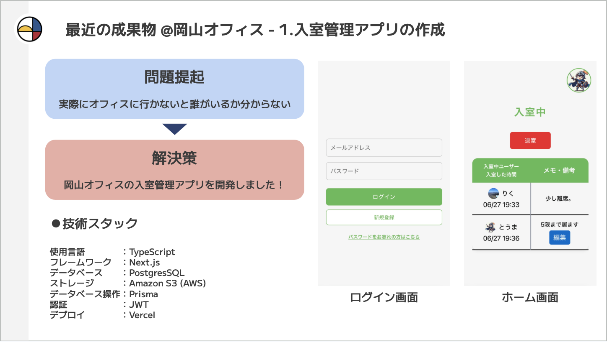

## 技術スタック

| 項目               | 技術・サービス                     | 詳細                             |
| ------------------ | ---------------------------------- | -------------------------------- |
| フレームワーク     | **Next.js 15.3.3**                 | React 19.0.0, TypeScript         |
| データベース       | **PostgreSQL + Prisma Accelerate** | 本番・開発共通                   |
| ORM                | **Prisma 6.10.1**                  | スキーマ管理・クエリ最適化       |
| 認証               | **JWT**                            | bcryptjs でパスワードハッシュ化  |
| ファイルストレージ | **Supabase Storage**               | アイコン画像のアップロード       |
| メール送信         | **Nodemailer + Gmail SMTP**        | パスワードリセット機能           |
| 入退室通知         | **Discord Webhook**                | 入退室を Discord で通知          |
| デプロイ           | **Vercel**                         | サーバーレス環境でのホスティング |
| CI/CD              | **GitHub Actions + Vercel**        | 自動テスト・デプロイパイプライン |

# Office Manager - オフィス管理アプリ

Next.js + Prisma + JWT 認証によるオフィス管理システムのポートフォリオプロジェクトです。

## アプリケーション概要

_エンジニアリングを行う学生団体(playgroud)のメンバーとして大学で発表しました。その時のスライドの一部です。_



## サービス概要

このアプリは、エンジニアリングを行う学生団体（playground）の岡山オフィスを利用する際の課題を解決するために開発しました。

### 解決した課題

**「実際にオフィスに行かないと誰がいるか分からない」**

従来は、オフィスに誰がいるのかを知るためには実際に現地に行く必要がありました。これにより、無駄足になったり、一人で作業することになったりする問題がありました。

### 提供する価値

**「いつ、どこからでもオフィスの在室状況を一目で把握」**

- **今誰々がいるから行こう** - メンバーの在室状況を確認してからオフィスに向かえる
- **誰もいないから今日はやめよう** - 無駄な移動時間を削減
- **リアルタイムな状況把握** - 入退室状況をリアルタイムで共有

**「オフィスの利用率向上」**

- **アプリを開かなくても在室状況が分かる**: メンバーが入室・退室したタイミングで即座に Discord に通知されるため、わざわざアプリを確認しなくても「今誰がいるか」を把握できます。
- **見逃し防止・集まりやすさ向上**: 「アプリを見ていなかったからメンバーがいることに気付かなかった」といった機会損失がなくなり、自然と集まりやすくなります。

これにより、メンバー間のコミュニケーションが活発になり、効率的なオフィス利用が実現できました。

---

## 技術選定の理由

### **Next.js 15.3.3 + React 19.0.0**

- **Vercel との親和性**: Next.js 公式推奨のホスティングサービスであり、デプロイ・スケーリング・SSL・CDN 最適化が自動化されている。特に main ブランチへの push で本番環境が自動更新され、プルリクエストごとにプレビュー環境も自動生成されるため、開発・レビュー体験が非常に良い。
- **App Router**: モダンなファイルベースルーティング
- **サーバーサイドレンダリング**: 初期表示速度の向上
- **TypeScript 統合**: 型安全性による開発効率の向上
- **API Routes**: フルスタック開発が 1 つのフレームワークで完結

### **PostgreSQL + Prisma Accelerate**

- **PostgreSQL**: 本格的なリレーショナルデータベースでの実装経験
- **Prisma ORM**: 型安全なクエリとスキーマ管理
- **Prisma Accelerate**: コネクションプールとクエリキャッシュでパフォーマンス最適化

### **JWT 認証 + bcryptjs**

- **ステートレス認証**: スケーラブルな認証システム
- **セキュリティ**: 業界標準のパスワードハッシュ化

### **Supabase Storage**

- **ファイルストレージ**: Supabase の公開バケットにアイコンを保管し、アップロード直後に公開 URL を取得
- **管理の容易さ**: SDK 経由でのアクセス制御・バケットメンテがシンプル

### **CI/CD パイプライン**

- **GitHub Actions**: コード品質チェック、自動テスト実行
- **Vercel 自動デプロイ**: main ブランチへの push 時に本番環境自動更新
- **プレビューデプロイ**: PR 作成時の自動プレビュー環境生成
- **環境変数管理**: 本番・開発環境での設定自動切り替え

## 機能概要

### ユーザー管理

- ユーザー登録（名前・メール・パスワード・アイコン画像）
- 所属オフィス選択（岡山 / 東京）とオフィス単位の認可コンテキスト
- JWT 認証によるログイン
- パスワードリセット（メール送信）

### 入退室管理

- 入室・退室の記録
- 入室者一覧の表示（ログインユーザーと同じオフィスのメンバーのみ）
- リアルタイム状態更新

### 通知機能

#### Discord 連携による入退室通知

オフィスへの入室・退室があるたびに、指定した Discord チャンネルへ自動で通知が送信されます。

- **通知内容**: 入室・退室したユーザー名を表示。

### セキュリティ機能

- bcryptjs によるパスワードハッシュ化
- JWT トークン認証（7 日間有効）
- CORS 対応（マルチデバイスアクセス）

## 技術的なポイント

### 楽観的 UI (Optimistic UI) 実装

入退室ボタン操作で即時 UX を向上させるため、API 完了を待たずフロント状態を先行更新。

### 流れ (例: 入室)

1. `entered` を即 `true` にセット / `isPending` と `pendingAction='enter'` を設定
2. API `POST /users/{id}/enter` 実行
3. 成功時: サーバー再取得 (`fetchUserAndEnteredUsers`) → 実際の入室一覧に自分が存在するか判定
4. 一致したら `isPending` / `pendingAction` を解除
5. 失敗時: 事前に保存した `prev` を使って `entered` をロールバック

### 退室も同様

- 退室時は一旦 `entered=false` に設定 → API 成功後、一覧から自分が消えたことを確認して確定

### エッジケース対応

- 連打防止: `isPending` が true の間はボタン無効化
- サーバー結果と食い違い時: 監視 `useEffect` で `enteredUsers` 差異を検出し安全に確定/解除
- エラー時: 例外キャッチで即ロールバック + フラグ解除

### パフォーマンス最適化

- **共有 Prisma Client**: インスタンス再利用で DB 接続最適化
- **Prisma Accelerate**: コネクションプール・クエリキャッシュ
- **ログイン時 Database Warmup**: 最適なタイミングで事前接続（重複防止）
- **効果**: 新規登録画面も即座に表示

### マルチオフィス対応

- `Office` テーブルを新設し、ユーザーごとに所属オフィスを管理
- 追加オフィスにも対応できるよう `connectOrCreate` で動的にシード
- ログイン後のダッシュボードでは所属オフィスのメンバーのみを自動フィルタ
- UI 上でも所属オフィスを明示して操作コンテキストを維持

### 環境別ファイル管理

- **開発 / 本番共通**: Supabase Storage の `office-manager-icon` バケットに直接アップロード
- **公開アイコン URL**: アップロード後に Supabase から取得した公開 URL を DB に保存し、Next.js Image コンポーネントで表示
- **サービスロールキー管理**: サーバーサイドのみで Supabase のサービスロールキーを利用し、クライアント側からは公開キーのみを使用

## OpenAPI ベースの SDK 運用

Web/Native 双方から同じバックエンド API を利用するため、OpenAPI 仕様 (`openapi/openapi.yaml`) をソース・オブ・トゥルースとして TypeScript SDK を自動生成しています。

### 手動生成手順

1. **Docker Desktop を起動**し、`openapitools/openapi-generator-cli:v7.5.0` イメージが利用できる状態にする。
2. ルートディレクトリで `npm run openapi:generate` を実行。
   - `scripts/openapi/generate.mjs` が Docker モードで OpenAPI Generator を呼び出し、`src/generated/openapi-client` を再生成します。
   - 生成後に `package.json` を補正し、`@office-manager/api-client` として publish 可能な構成を維持します。

生成された SDK には `dist/`（ビルド成果物）を出力するための `npm run build` スクリプトが含まれます。Web/Native プロジェクトでは以下のように依存追加して利用します。

```bash
npm install @office-manager/api-client
```

### CI での自動 publish

`.github/workflows/publish-openapi-client.yml` は `openapi/**` に変更が入った push をトリガーし、以下を実行します。

- `npm run openapi:generate` で SDK を再生成
- `src/generated/openapi-client` で `npm install` → `npm run build`
- `npm publish --access restricted`

`NPM_TOKEN` シークレットを設定することで Private npm レジストリへ自動公開されます。必要に応じて `workflow_dispatch` で手動実行も可能です。

### セキュリティ実装

- bcryptjs による安全なパスワードハッシュ化
- JWT トークン認証（7 日間有効）
- CORS 設定（相対 URL 使用）

### API エンドポイントの相対パス化

本番環境では `API_BASE_URL` を `/api` のような相対パスで指定しています。これにより、Vercel などのサーバーレス環境やプレビュー環境でも、ドメインやサブドメインの違いを意識せずに API 通信が可能です。

- **メリット**: デプロイ先の URL が変わっても設定変更不要。CORS エラーや環境ごとの URL 管理の手間を削減。
- **開発環境**: `http://localhost:3000/api` など絶対パスで API にアクセス。
- **本番環境**: `/api` の相対パスで API にアクセス。

開発環境（localhost）では API ルートとフロントエンドが同じポート（例: 3000）で動作するので、相対パスだと意図しない URL に飛ぶことがあります。
特に、Storybook や外部ツール、テスト環境、または別ポートでフロントエンドを動かしている場合、相対パスだと API リクエストが正しく localhost:3000 に届かず、通信エラーや CORS エラーになることがあります。
そのため、開発時は`http://localhost:3000/api`のような絶対パスを使うことで、どこからでも確実に API へアクセスできるようにしています。

### CI/CD パイプライン

- **GitHub Actions**: ESLint によるコード品質チェック、型検査の自動実行
- **Vercel 自動デプロイ**: Git push トリガーでの本番環境自動更新
- **プレビュー環境**: プルリクエスト毎の独立した検証環境
- **ゼロダウンタイム**: ローリングデプロイによる無停止更新
- **テスト自動実行 & カバレッジ収集**: PR や main ブランチへの push 時に Jest でユニットテストを自動実行し、カバレッジレポート（HTML/LCOV）や JUnit 形式のテスト結果を CI 上に保存。

## テスト戦略

本プロジェクトでは **Jest (@latest v30)** を利用したユニットテスト中心の構成。

### 対象範囲

- `src/app/api/**/route.ts` : API Route の純粋関数性を活かし **NextRequest/NextResponse** を直接呼び出す形でテスト
- `src/lib` : Prisma クライアントラッパ / 設定モジュール
- `src/utils` : 日付ユーティリティなど副作用を持たない関数群

### モック戦略

- **Prisma**: `jest.mock('@/lib/prisma')` で `prisma.user.findUnique` などを差し替え DB 依存を排除
- **JWT**: `jsonwebtoken.verify` をモックしトークン検証分岐を網羅
- **Warmup / Singleton**: グローバルキャッシュ挙動をテストし再接続抑制を検証

### カバレッジ

`npm test` 実行時に `--coverage` で収集し、`coverage/` に HTML / lcov / text を出力。主な対象は:

```
src/utils/**/*
src/app/api/**/*
src/lib/**/*
```

## CI (GitHub Actions) 詳細

ワークフロー: `.github/workflows/test.yml`

### トリガー

- `pull_request` → `main` ブランチ
- `push` → `main`

### 実行ステップ概要

1. チェックアウト
2. Node 20 セットアップ（npm キャッシュ利用）
3. `npm ci --include=dev` で prod+dev 依存を完全再現
4. PostgreSQL(16) サービス起動（ヘルスチェックで待機）
5. `prisma generate` → クライアント生成
6. `prisma migrate deploy` → 本番互換のマイグレーション適用
7. `npm test -- --ci --reporters=default --reporters=jest-junit`
8. 成功時: `coverage/` をアーティファクト保存
9. 常時: `junit.xml` (jest-junit) を保存

### 生成物

- `coverage-report` (HTML/LCOV)
- `junit-report` (CI 上のテスト可視化用)

### テストコードを実装した意図

今後さまざまな機能追加やリファクタリングを行う際、「既存機能が壊れていないかの確認に毎回多くの時間を取られる」といった状況を避け、安心して開発できる体験を実現するためです。
